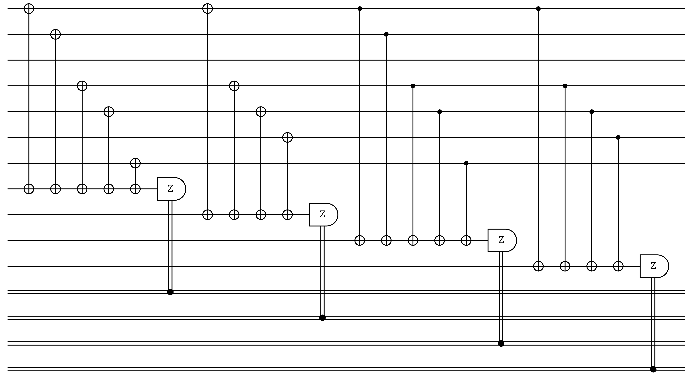

# Bicycle

## Description
 - This LDPC code is based on circulant matrices of difference sets.
 - The difference should satisfy the property that each every difference (modulo N/2) in the set occurs at most once
 - This is a CSS code where each sub-matrix is constructed from the circulant and it's transpose horizontally contatinated. This sub-matrix then has some of it's rows removed while trying to keep the number of checks per column the same.

## Example
Code Tableau:
_XX_XX__
__XX_XX_
X__X__XX
_ZZ_ZZ__
__ZZ_ZZ_
Z__Z__ZZ
- Number of qubits: N = 8
- Number of encoded bits: k = 2
- The Bicycle code is degenerate!
### Syndrome Circuit:

## Benchmarking Results

This code was tested with the following decoders:

**Lookup table:** Ran in 8.36s

**Belief decoder:** Ran in 27.8s

**Belief decoder:** Ran in 27.8s

## 

## ## QASM Downloads
[QASM Encoding Circuit](QASMDownloads\Bicycle-encodingCircuit.qasm)

## Similar Codes 
- **[Unicycle Codes](https://arxiv.org/abs/quant-ph/0304161)**: Circulant code based on perfect difference sets

## References
David J.C. MacKay, Graeme Mitchison, Paul L. McFadden, Sparse Graph Codes for Quantum Error-Correction, IEEE Transactions on Information Theory, Vol. 50, No. 10, p. 2315 (2004), [DOI](https://doi.org/10.1109/TIT.2004.834737)