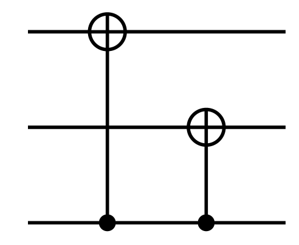
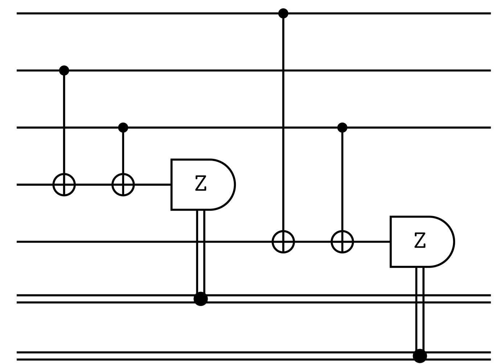

# Bitflip-3

## Description
 - The simplest error correcting code that can correct a single bit-flip error.
 - Unable to correct phase errors.

## Example
- Number of qubits: N = 3
- Number of encoded bits: k = 1
- The Bitflip-3 code is degenerate!

<details><summary><h3>Code Tableau</h3></summary>

```
+ _ZZ
+ Z_Z
```
</details>


<details><summary><h3>Encoding Circuit</h3></summary>


</details>
<details><summary><h3>Syndrome Circuit</h3></summary>


</details>

## Benchmarking Results

This code was tested with the following decoders:

### TableDecoder and NaiveSyndromeECCSetup


## QASM Downloads
[QASM Bitflip-3 Naive Encoding Circuit](QASMDownloads\Bitflip-3-naive_encoding_circuit.qasm)

[QASM Bitflip-3 Naive Syndrome Circuit](QASMDownloads\Bitflip-3-naive_syndrome_circuit.qasm)

## Similar Codes 
- **[Shor-9](https://math.mit.edu/~shor/papers/good-codes.pdf)**: Degenerate CSS code designed to account for parity errors

## References
, Repetition code, Wikipedia