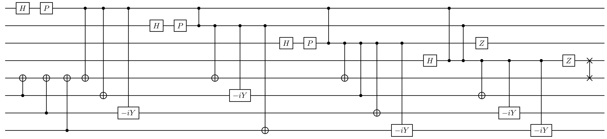
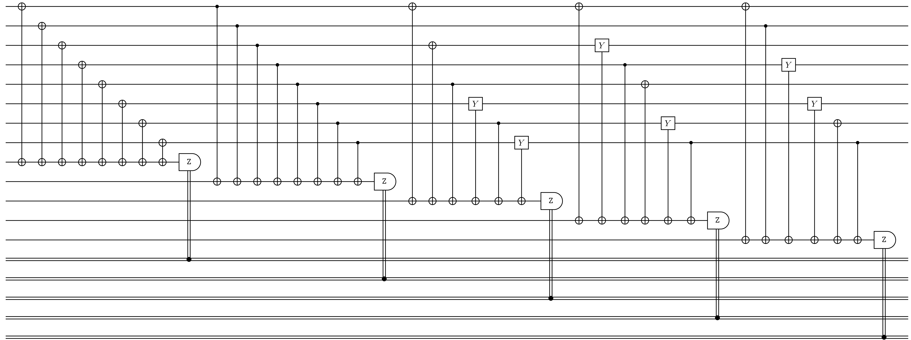

# Cleve-8

## Description
 - Quantum error correcting code that encodes 3 logical qubits into 8 logical qubits.
 - Description 2.

## Example
- Number of qubits: N = 8
- Number of encoded bits: k = 3
- The Cleve-8 code is not degenerate.

<details><summary><h3>Code Tableau</h3></summary>

```
+ XXXXXXXX
+ ZZZZZZZZ
+ X_X_ZYZY
+ X_YZX_YZ
+ XZ_Y_YXZ
```
</details>


<details><summary><h3>Encoding Circuit</h3></summary>


</details>
<details><summary><h3>Syndrome Circuit</h3></summary>


</details>

## Benchmarking Results

This code was tested with the following decoders:

### TableDecoder and NaiveSyndromeECCSetup


## QASM Downloads
[QASM Cleve-8 Naive Encoding Circuit](QASMDownloads\Cleve-8-naive_encoding_circuit.qasm)

[QASM Cleve-8 Naive Syndrome Circuit](QASMDownloads\Cleve-8-naive_syndrome_circuit.qasm)

## Similar Codes 
- **[Steane-7](./Steane7.md)**: CSS code, capable of correcting single-bit errors
- **[Shor-9](./Shor.md)**: Degenerate CSS code designed to account for parity errors

## References
Cerf, N. and Cleve, R., Information-theoretic interpretation of quantum error-correcting codes, Proc R Soc A