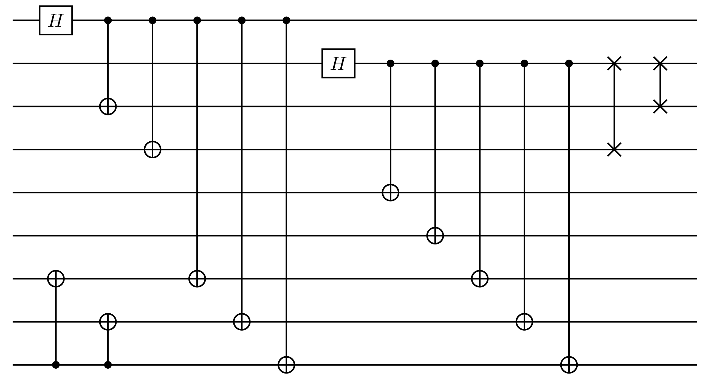
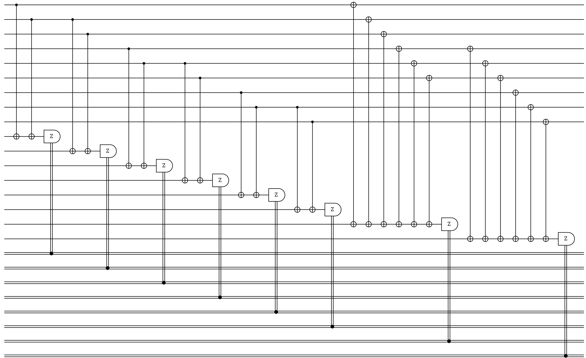

<script type="module" src="index.js"></script>

# Shor-9

## Description
 - Nine-qubit CSS code that is the first quantum error-correcting code.

## Example
- Number of qubits: N = 9
- Number of encoded bits: k = 1
- The Shor-9 code is degenerate!

$$
a = 
$$

<details><summary><h3>Code Tableau</h3></summary>

```
+ ZZ_______
+ _ZZ______
+ ___ZZ____
+ ____ZZ___
+ ______ZZ_
+ _______ZZ
+ XXXXXX___
+ ___XXXXXX
```
</details>


<details><summary><h3>Encoding Circuit</h3></summary>


</details>
<details><summary><h3>Syndrome Circuit</h3></summary>


</details>

## Benchmarking Results

This code was tested with the following decoders:

### TableDecoder and NaiveSyndromeECCSetup


### TableDecoder and ShorSyndromeECCSetup


### BeliefPropDecoder and NaiveSyndromeECCSetup


### BeliefPropDecoder and ShorSyndromeECCSetup


### PyMatchingDecoder and NaiveSyndromeECCSetup


### PyMatchingDecoder and ShorSyndromeECCSetup


## QASM Downloads
[QASM Shor-9 Naive Encoding Circuit](QASMDownloads\Shor-9-naive_encoding_circuit.qasm)

[QASM Shor-9 Naive Syndrome Circuit](QASMDownloads\Shor-9-naive_syndrome_circuit.qasm)

## Similar Codes 
- **[sample name](sample link)**: short desc
- **[Surface Code](https://www.nature.com/articles/s41586-022-05434-1)**: This is a surface code hehe

## References
Nathanan Tantivasadakarn and Ruben Verresen and Ashvin Vishwanath, Shortest Route to Non-Abelian Topological Order on a Quantum Processor, Physical Review Letters, [DOI](https://doi.org/10.1103/PhysRevLett.131.060405)