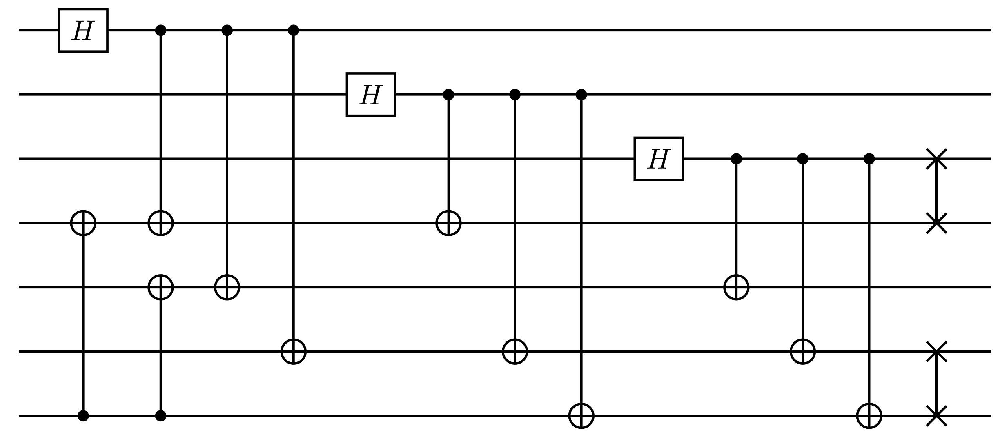
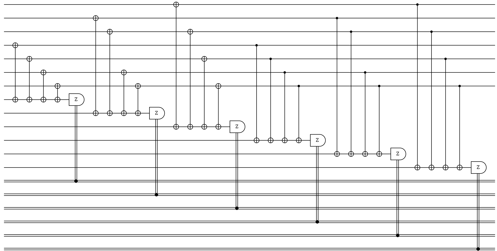

# Steane-7

## Description
 - The Steane code is a quantum error-correcting code that encodes a single logical qubit into seven physical qubits.
 - This code is designed to correct for any single qubit error, which includes both bit-flip (analogous to classical bit errors) and phase-flip (a uniquely quantum error) errors.

## Example
- Number of qubits: N = 7
- Number of encoded bits: k = 1
- The Steane-7 code is not degenerate.

<details><summary><h3>Code Tableau</h3></summary>

```
+ ___XXXX
+ _XX__XX
+ X_X_X_X
+ ___ZZZZ
+ _ZZ__ZZ
+ Z_Z_Z_Z
```
</details>


<details><summary><h3>Encoding Circuit</h3></summary>


</details>
<details><summary><h3>Syndrome Circuit</h3></summary>


</details>

## Benchmarking Results

This code was tested with the following decoders:

### TableDecoder and NaiveSyndromeECCSetup


### BeliefPropDecoder and NaiveSyndromeECCSetup


## QASM Downloads
[QASM Steane-7 Naive Encoding Circuit](QASMDownloads\Steane-7-naive_encoding_circuit.qasm)

[QASM Steane-7 Naive Syndrome Circuit](QASMDownloads\Steane-7-naive_syndrome_circuit.qasm)

## Similar Codes 
- **[Shor-9](https://math.mit.edu/~shor/papers/good-codes.pdf)**: Degenerate CSS code designed to account for parity errors

## References
Andrew Steane, Multiple Particle Interference and Quantum Error Correction, Proc.Roy.Soc.Lond. A452 (1996) 2551, [DOI](https://doi.org/10.1098/rspa.1996.0136)