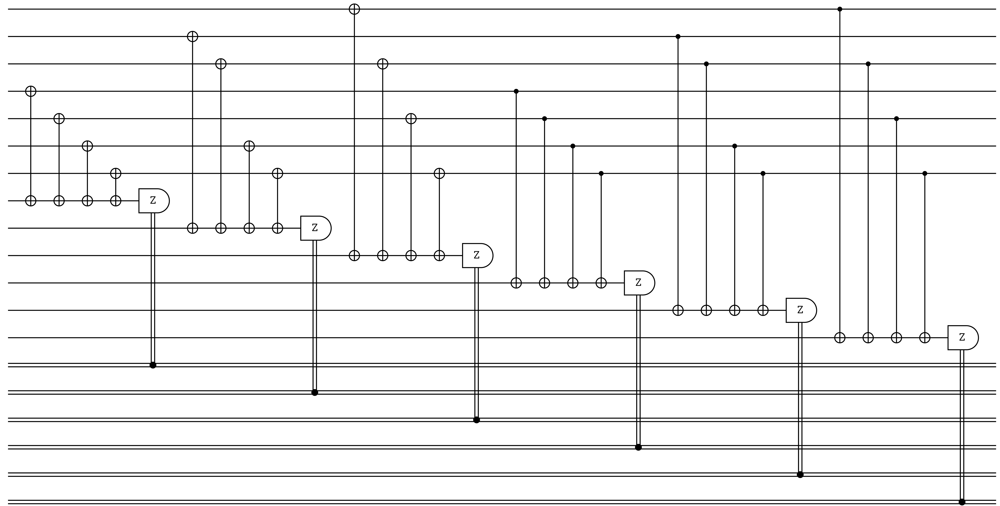

# Steane7

## Description
 - This is also among the CSS codes and among the first quantum error-correcting code

## Example
- Number of qubits: N = 7
- Number of encoded bits: k = 1
### Syndrome Circuit:

## Benchmarking Results

## 

## Similar Codes 
- **[sample name](sample link)**: short desc
- **[Surface Code](https://www.nature.com/articles/s41586-022-05434-1)**: This is a surface code hehe

## References
Nathanan Tantivasadakarn and Ruben Verresen and Ashvin Vishwanath, Shortest Route to Non-Abelian Topological Order on a Quantum Processor, Physical Review Letters, [DOI](https://doi.org/10.1103/PhysRevLett.131.060405)